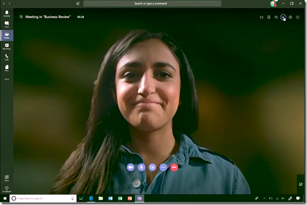
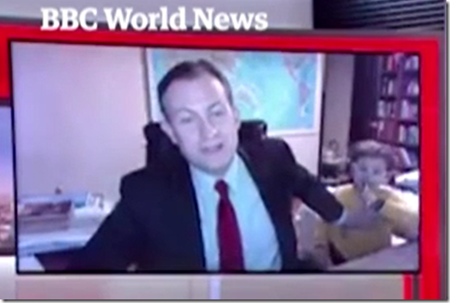
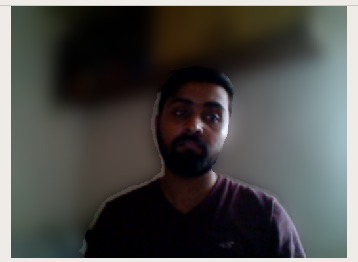

# Real Time Background Blurring using DeeplabV3
This repository contains the code for real time background blurring using deep learning model *[DeeplabV3](https://arxiv.org/abs/1706.05587)*. We used the [Keras implementation of DeeplabV3](https://github.com/bonlime/keras-deeplab-v3-plus) with pretrained weights. 

## Introduction
Few months back Microsoft introduced Teams with a background blur feature for video calls using AI which catch the attention of the several people. As you can see in the image below.



You can read more about the Microsoft Team [here](https://www.businessinsider.de/microsoft-teams-gets-free-version-background-blur-feature-2018-7?r=US&IR=T)


Blurring the video background using machine learning can help reduce us videoconferencing faux pas. Basically if you have an interview or a very important meeting and you are at home or coffee shop just use this feature and it can save you from lots of embarrassment. 




You can read the blog post about it [here](http://amanullahtariq.com/blog_posts/realtime_bg_blur.html) 


## DeepLabV3
 DeeplabV3 is a state-of-the-art model for Semantic Segmentation develop by Google Inc. We are using [this](https://github.com/bonlime/keras-deeplab-v3-plus) implementation of DeepLabV3 in Keras.


## Results
For the experiement, we used the real-time input from the webcam and blur the background of it. To keep it simple and easy we didn't used any *data preprocessing* or *computer vision* techniques to improve the input to the machine learning model. For the testing place the camera in the low light to check effective-ness and completeness of our approach. 




## Run

Goto the script directory and run the python script
```
python main.py
```


## Requiremnts
For this project to run you need:
* Python 3.5
* Tensorflow 1.4
* OpenCV
* imutils
* Keras


## References

1.  **Encoder-Decoder with Atrous Separable Convolution for Semantic Image Segmentation**<br />
    Liang-Chieh Chen and Yukun Zhu and George Papandreou and Florian Schroff and Hartwig Adam <br />
    [[link]](https://arxiv.org/abs/1802.02611). In ECCV, 2018.

2.  **MobileNetV2: Inverted Residuals and Linear Bottlenecks** <br />
    Mark Sandler and Andrew Howard and Menglong Zhu and Andrey Zhmoginov and Liang-Chieh Chen. <br />
    [[link]](https://arxiv.org/abs/1801.04381). In CVPR, 2018.


### Contact
* Amanullah Tariq 
* Email: amanullah.tariq@gmail.com
* Website: http://amanullahtariq.com/
* Github: http://github.com/amanullahtariq
* Linkedin: https://www.linkedin.com/in/amanullahtariq/
